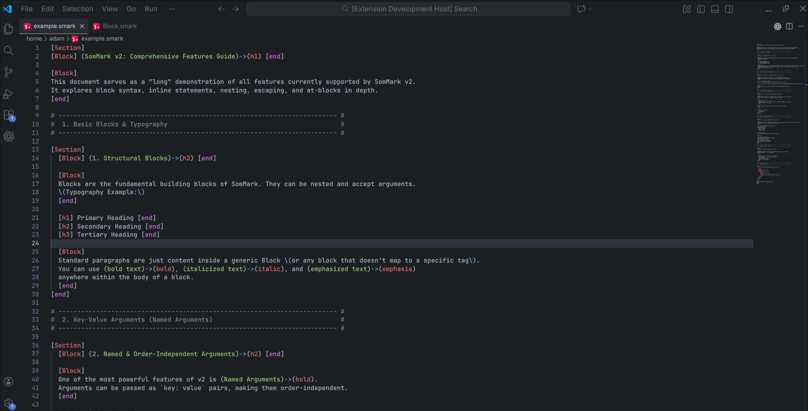

# SomMark VSCode

### Version 2.0.1

The official VS Code extension for the SomMark markup language.

## What's New in v2.0.1

- **Fixed Activation Issue**: Resolved a critical bug preventing the extension from activating on some systems.
- **Stability Improvements**: Aligned development dependencies for better stability.

## Features

- Accurate syntax highlighting for Blocks, At-Blocks, and Inline statements.
- Support for SomMark comments and escape sequences.
- Clean and modern integration with VS Code themes.

## Usage

Simply open any `.smark` file, and the extension will automatically activate.

## Resources

- [SomMark Language Repo](https://github.com/Adam-Elmi/SomMark)
- [SomMark VSCode Repo](https://github.com/Adam-Elmi/SomMark-Vscode)
